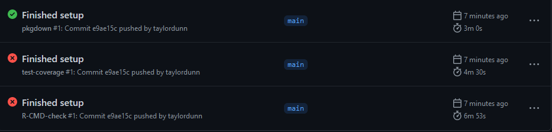

```{r setup, include=TRUE, code_folding="Setup"}
knitr::opts_chunk$set(echo = TRUE, eval = FALSE)
library(tidyverse)

library(dunnr)
#extrafont::loadfonts(device = "win", quiet = TRUE)
theme_set(theme_td())
set_geom_fonts()
set_palette()
```

## Introduction

In [my previous post](../2021-12-28-canada-covid-19-data-in-r-exploring-the-api/#summary), I explored the 
[Canadian COVID-19 tracker API](https://api.covid19tracker.ca/) and decided to make an API wrapper package to facilitate using it in R.

## Naming

The first, and [some](https://devguide.ropensci.org/building.html#package-name-and-metadata) [would say](https://r-pkgs.org/workflows101.html#naming) [the hardest step](https://www.njtierney.com/post/2018/06/20/naming-things/) for writing a package (or any piece of code for that matter) is naming it.
I considered a lot of options, and in the end decided on the admittedly boring `canadacovid`, which I verified was available:

```{r eval=TRUE, cache=TRUE}
available::available("canadacovid", browse = FALSE)
```

## General steps

With the `usethis` and `devtools` packages, getting an R package started with best practices is very easy.

First, I create the package, set it up on GitHub and do some minor documentation:

1. `usethis::create_tidy_package("canadacovid")`: creates the RStudio project and opens it.
2. Connect GitHub.
    * `usethis::use_git()` creates the local repo.
    * `usethis::use_github()` creates the repo on GitHub and makes an initial commit and push.
    * `usethis::use_tidy_github()` adds some files to follow `tidyverse` package conventions, e.g. a template `contributing.md`.
    * `usethis::use_github_actions()` configures a basic `R CMD check` workflow on GitHub actions. ^[Using GitHub actions is new to me, and probably overkill for a small hobby project like this, but I was inspired by [Jim Hester's RStudio::Conf 2020 talk](https://www.rstudio.com/resources/rstudioconf-2020/azure-pipelines-and-github-actions/) to give it a try.]
    * `usethis::use_tidy_github_actions()` sets up additional workflows for GitHub actions.
3. As ` tidyverse` enthusiast, I always setup my packages to use `magittr`'s pipe operator `%>%` with `usethis::use_pipe`.
4. `usethis::use_testthat()` sets up the `testthat` package and directory structure.
    * This step actually isn't necessary, as it was already done by `create_tidy_package`.
4. Update the `DESCRIPTION` file, particularly the `Title`, `Descrption` and `Authors` fields.
5. Run `devtools::document()` which will update the `NAMESPACE` file with the `magittr` pipe.

Immediately after pushing these setup steps to GitHub, GitHub actions got to work but failed on two of three workflows:



Both the `R CMD` and the test coverage workflows failed because I haven't written any tests yet (or functions to be tested for that matter).
Which brings me to the main package development process:

1. `usethis::use_r("file-name")` creates the `R/file-name.R` file.
2. Add one or more R functions to `file-name.R`.
3. `usethis::use_package("dependency")` is used to declare any package dependencies, updating the `DESCRIPTION` file.
4. Document the function(s):
    * In RStudio, select `Code -> Insert Roxygen Skeleton` (or Ctrl+Alt+Shift+R on Windows).
    * Run `devtools::document()` to generate the `.Rd` file and update `NAMESPACE`.
    * Optional: check the documentation with `?func-name`.
    * Optional: if using examples, check them with `devtools::check_examples()`.
5. Try it out.
    * `devtools::load_all()` to load all package functions (Ctrl+Shift+L on Windows).
    * `devtools::check()` runs `R CMD check` on the package.
6. Write tests with `testthat`.
    * `use_test("file-name")` creates the `tests/testthat/test-file-name.R` file, paired to `R/file-name.R` file.
    * `devtools::test()` or `usethis::test_package()` runs all tests.
    * `devtools::test_active_file()` tests just the active file.
7. Optional: update the `README.Rmd` with new functionality.
    * `devtools::build_readme()` to knit.
8. Optional: write or update a vignette to incorporate new functionality.
    * `usethis::use_vignette("vignette-name")` to initialize the vignette file.
    * `devtools::build_vignettes()` to knit the vignettes.

## Summary

The first function I will add will retrieve the latest summary data from the API.
I will call this file `summary.R`, and create it (and it's associated test file) with:

```{r}
usethis::use_r("summary")
usethis::use_test("summary")
```

And here is the `get_summary` function added to `R/summary.R`:

```{r eval=TRUE}
get_summary <- function(split = c("overall", "province", "region")) {
  split <- match.arg(split)
  base_url <- "https://api.covid19tracker.ca/summary"
  split_path <- switch(split,
                       overall = "", province = "/split", region = "/split/hr")
  url <- paste0(base_url, split_path)

  resp <- httr::GET(url)

  if (httr::http_error(resp)) {
    stop(paste("API requested failed with code", httr::status_code(resp)),
         call. = FALSE)
  }

  if (httr::http_type(resp) != "application/json") {
    stop("API did not return JSON", call. = FALSE)
  }

  content_parsed <-
    jsonlite::fromJSON(httr::content(resp, "text", encoding = "UTF-8"),
                       simplifyVector = FALSE)

  dplyr::bind_rows(content_parsed$data) %>%
    dplyr::bind_cols(content_parsed["last_updated"]) %>%
    dplyr::mutate(
      dplyr::across(tidyselect::matches("^change|total"), as.integer),
      dplyr::across(tidyselect::matches("date"), as.Date),
      last_updated = as.POSIXct(.data$last_updated)
    )
}
```

Some notes:

* See [my previous post](../2021-12-28-canada-covid-19-data-in-r-exploring-the-api/#summary) for a more thorough explanation of how this code is interacting with the API and processing the data.
* For all of the imported functions, it is [good practice to explicitly state the package](https://r-pkgs.org/namespace.html#import-r), e.g. `httr::GET`.
    * The exception is the very last line where I use `rlang` to refer to the variable `.data$last_updated`. I find it clunky to include package names within pipe operations like that.
* `match.arg` is a helpful base R function which matches the `split` parameter to just one of the given values. It returns an error if an unexpected value is provided.
* I followed the advice from [this `httr` vignette](https://cran.r-project.org/web/packages/httr/vignettes/api-packages.html) and turned API errors into R errors.
    * The `httr::http_error` conditional returns an error message if the GET request failed, with the resulting HTTP status code.
    * The `httr::http_type` conditional returns an error message if the content is not in JSON format as expected.
* Instead of using the `as = "parsed"` argument to `httr::content`, I parse the raw text directly using `jsonlite::fromJSON`.
    * See [this warning from the `httr` documentation](https://httr.r-lib.org/reference/content.html#warning) for the reason.
    
Add the dependencies:
    
```{r}
usethis::use_package("httr", type = "Imports")
usethis::use_package("jsonlite", type = "Imports")
usethis::use_package("dplyr", type = "Imports")
usethis::use_package("tidyselect", type = "Imports")
usethis::use_package("rlang", type = "Imports")
```

I've explicitly set the `type` to "Imports" (which wasn't necessary as this is the default) to make the point that it is [recommended over "Depends"](https://r-pkgs.org/namespace.html#search-path):
  
>Unless there is a good reason otherwise, you should always list packages in Imports not Depends. That’s because a good package is self-contained, and minimises changes to the global environment (including the search path). 
    
Next, some [Roxygen documentation](https://r-pkgs.org/man.html#roxygen-comments):
    
```{r}
#' Get the most recent summary data
#'
#' Runs a GET request of summary data from the COVID-19 tracker API, and
#' returns parsed data.
#' Via the `split` argument, data my be "overall" (all provinces/territories
#' combined), by "province" (one row per province/territory) or by "region"
#' (one row per health region).
#'
#' @param split One of "overall", "province", or "region" to specify how the
#'   data is split.
#'
#' @return A data frame containing the summary data.
#' @export
#'
#' @examples
#'
#' get_summary()
#' get_summary("province")
#' get_summary("region")
#'
#' @importFrom httr GET http_error http_type content
#' @importFrom jsonlite fromJSON
#' @importFrom dplyr bind_rows bind_cols mutate across
#' @importFrom tidyselect matches
#' @importFrom rlang .data
get_summary <- function(split = c("overall", "province", "region")) {
  ...
```

Now I'll edit the `test-summary.R` file with some simple tests (and run it here as an example):

```{r eval=TRUE}
library(testthat)

test_that("get_summary works", {
  expect_error(get_summary(split = "provice"), "arg")

  summary_overall <- get_summary()
  expect_equal(nrow(summary_overall), 1)
  expect_equal(ncol(summary_overall), 22)
  expect_false(any(is.na(summary_overall)))

  summary_province <- get_summary(split = "province")
  expect_equal(nrow(summary_province), 13)
  expect_equal(ncol(summary_province), 23)
  expect_false(any(is.na(summary_province)))
  expect_setequal(summary_province$province,
                  c("ON", "QC", "NS", "NB", "MB", "BC", "PE", "SK", "AB",
                    "NL", "NT", "YT", "NU"))

  summary_region <- get_summary(split = "region")
  expect_equal(nrow(summary_region), 92)
})
```

Everything passed successfully.
Here is what was tested, from top to bottom:

* An error was returned for a misspelled `split` argument.
* `summary_overall` has the expected number of rows, columns and no values are `NA`.
* `summary_province` has the expected number of rows, columns and no values are `NA`. Also the expected 13 provinces/territories are returned.
* `summary_region` has the expected number of rows. The number of columns will vary, because columns with all missing (`NULL`) values will be dropped.

Now with a documented and tested function, I do the following:

* `devtools::check()` to run a `R CMD check` (also runs the `testthat` tests), which passes.
* Update the `README.Rmd` with installation instructions, and an example of using `get_summary()`. Then build with `devtools::build_readme()`.

I pushed this first iteration of the package to GitHub and, after about 10 minutes, all of the GitHub actions workflows were successful:


## Detour: refactoring code (already)

Before continuing with other functions, it occurred to me that I would end up re-writing this particular block of code multiple times:

```{r}
resp <- httr::GET(url)

if (httr::http_error(resp)) {
  stop(paste("API requested failed with code", httr::status_code(resp)),
       call. = FALSE)
}

if (httr::http_type(resp) != "application/json") {
  stop("API did not return JSON", call. = FALSE)
}

content_parsed <-
  jsonlite::fromJSON(httr::content(resp, "text", encoding = "UTF-8"),
                     simplifyVector = FALSE)
```

A quote from [R for Data Science book](https://r4ds.had.co.nz/functions.html?q=function#when-should-you-write-a-function):

>You should consider writing a function whenever you’ve copied and pasted a block of code more than twice (i.e. you now have three copies of the same code).

So instead of copying and pasting this code block, I made a new function in a new file:

```{r}
usethis::use_r("reports")
usethis::use_test("reports")
```

```{r eval=TRUE}
#' Get content and parse it
#'
#' Sends a GET request to https://api.covid19tracker.ca/.
#' If the request is successful and the returned content is JSON, formats it and
#' returns it parsed (via `jsonlite::fromJSON`).
#'
#' @param url A string URL linking to the API. If it does not contain the base
#'   "https://api.covid19tracker.ca", then `url` will be combined with the base
#'   to attempt to make a valid URL (and return a warning).
#'
#' @return A list.
#' @export
#'
#' @examples
#'
#' get_content_parsed("https://api.covid19tracker.ca/provinces")
#'
#' @importFrom httr GET http_error http_type content
#' @importFrom jsonlite fromJSON
#' @importFrom stringr str_detect
get_content_parsed <- function(url) {
  base_url <- "https://api.covid19tracker.ca"
  if (!stringr::str_detect(url, base_url)) {
    url <- paste0(base_url, "/", url)
    warning(
      paste0("Provided URL did not include base (", base_url, ").\n",
             "Combined URL with base for GET request: ", url)
    )
  }

  resp <- httr::GET(url)

  if (httr::http_error(resp)) {
    stop(paste("API requested failed with code", httr::status_code(resp)),
         call. = FALSE)
  }

  if (httr::http_type(resp) != "application/json") {
    stop("API did not return JSON", call. = FALSE)
  }

  jsonlite::fromJSON(httr::content(resp, "text", encoding = "UTF-8"),
                     simplifyVector = FALSE)
}
```

This function expects a full `url`, but will add "https://api.covid19tracker.ca" if it is missing (and return a warning).
Some simple tests for `get_content_parsed`:

```{r eval=TRUE}
test_that("get_content_parsed works", {
  expect_warning(get_content_parsed("provinces"), "base")
  expect_error(
    get_content_parsed("https://api.covid19tracker.ca/provices"), "API"
  )

  provinces <- get_content_parsed("https://api.covid19tracker.ca/provinces")
  expect_true(is.list(provinces))
  expect_equal(lengths(provinces), rep(12, 16))
})
```

Everything checks out.
I don't need to re-write tests for `get_summary()` but I *do re-run those tests* to make sure I didn't break it with these changes (this is the whole point of unit testing).
I then run `devtools::check()` and push changes to GitHub.

## Reports

Writing the function to get reports follows the same procedure:

```{r}
usethis::use_r("reports")
usethis::use_test("reports")
```

The reports are a bit more complicated because the queries can [accept a few different parameters](../2021-12-28-canada-covid-19-data-in-r-exploring-the-api/#parameters).
Here is my first draft of `get_reports`, along with Roxygen documentation:


```{r eval=TRUE}
#' Get the day-to-day reports
#'
#' Runs a GET request of reports data from the COVID-19 tracker API, and
#' returns parsed data.
#' Via the `split` argument, data may be "overall" (all provinces/territories
#' combined), or by "province".
#' Alternatively, provide one or more two-letter codes (e.g. "AB") to `province`
#' to return reports for specific provinces, or one or more numeric `region`
#' codes (e.g. "1204") to return specific health regions.
#'
#' @param split One of "overall", or "province" to specify how the
#'   data is split. An "overall" report gives cumulative numbers across Canada.
#'   Splitting by "province" returns all reports for all provinces/territories.
#' @param province One or more province/territory codes ("AB", "BC", "MB", "NB",
#'   "NL", "NS", "NT", "NU", "ON", "PE", "QC", "SK", "YT") to get reports.
#'   Upper, lower and mixed case strings are accepted.
#' @param region One or more health region IDs to get reports. Numeric and
#'   character values are accepted.
#'
#' @return A data frame containing the reports data, one row per day. Includes
#'   a `province` variable if data is split by province, and a `hr_uid` variable
#'   if data is split by health region.
#' @export
#'
#' @examples
#'
#' get_reports()
#' get_reports("province")
#' get_reports(province = c("AB", "SK"))
#' get_reports(region = 1204)
#' get_reports(region = c("472", 1204))
#' @importFrom dplyr bind_rows bind_cols mutate across
#' @importFrom tidyselect matches
#' @importFrom rlang .data
#' @importFrom purrr imap_chr map_dfr
#' @importFrom tibble lst
get_reports <- function(split = c("overall", "province"),
                        province = NULL, region = NULL,
                        fill_dates = NULL, stat = NULL, date = NULL,
                        after = NULL, before = NULL) {
  base_url <- "https://api.covid19tracker.ca/reports/"
  province_codes <- c(
    "AB", "BC", "MB", "NB", "NL", "NS", "NT", "NU", "ON",
    "PE", "QC", "SK", "YT"
  )

  split <- match.arg(split)
  if (split == "province") province <- province_codes

  parameters <- tibble::lst(fill_dates, stat, date, after, before)
  # Remove NULL parameters
  parameters <- parameters[lengths(parameters) == 1]
  if (length(parameters) > 0) {
    params_url <- purrr::imap_chr(parameters, ~ paste0(.y, "=", tolower(.x))) %>%
      paste(collapse = "&")
    params_url <- paste0("?", params_url)
  } else {
    params_url <- ""
  }

  if (!is.null(province)) {
    province <- match.arg(
      toupper(province),
      choices = c(
        "AB", "BC", "MB", "NB", "NL", "NS", "NT", "NU", "ON", "PE",
        "QC", "SK", "YT"
      ),
      several.ok = TRUE
    )

    reports <- purrr::map_dfr(
      province,
      function(province) {
        url <- paste0(base_url, "province/", province, params_url)
        content_parsed <- get_content_parsed(url)

        dplyr::bind_cols(
          content_parsed[c("province", "last_updated")],
          dplyr::bind_rows(content_parsed$data)
        )
      }
    )
  } else if (!is.null(region)) {
    reports <- purrr::map_dfr(
      region,
      function(region) {
        url <- paste0(base_url, "regions/", region, params_url)
        content_parsed <- get_content_parsed(url)

        dplyr::bind_cols(
          content_parsed[c("hr_uid", "last_updated")],
          dplyr::bind_rows(content_parsed$data)
        )
      }
    )
  } else {
    content_parsed <- get_content_parsed(paste0(base_url, params_url))
    reports <- dplyr::bind_cols(
      content_parsed["last_updated"],
      dplyr::bind_rows(content_parsed$data)
    )
  }

  reports %>%
    dplyr::mutate(
      dplyr::across(tidyselect::matches("^change|total"), as.integer),
      dplyr::across(tidyselect::matches("date"), as.Date),
      last_updated = as.POSIXct(.data$last_updated)
    )
}
```

<aside>

And the new dependencies:

```{r}
usethis::use_package("tibble")
usethis::use_package("purrr")
```

</aside>

Note that I didn't allow `split = "region"` as an option because, if the function queries all regions, 92 separate `GET` requests are sent to the API in a short period.
This eventually fails with HTTP code 429, indicating too many requests.
This is called "rate limiting", and the error code is a polite way of asking someone to stop spamming requests.
I might alter this function in the future to send these requests slower, either with a call to `Sys.sleep()` or with the [`polite` package](https://github.com/dmi3kno/polite).

`get_reports` is a more complex function than `get_summary`, and so I wrote more tests to try to capture that complexity:


```{r eval=TRUE}
test_that("get_reports works", {
  reports_overall <- get_reports()
  expect_equal(ncol(reports_overall), 22)
  expect_equal(
    reports_overall$date,
    seq.Date(min(reports_overall$date), max(reports_overall$date), by = "day")
  )
  expect_false(any(is.na(reports_overall)))

  reports_province <- get_reports(split = "province")
  expect_equal(dplyr::n_distinct(reports_province$province), 13)
  expect_equal(min(reports_province$date), min(reports_overall$date))
  expect_equal(max(reports_province$date), max(reports_overall$date))

  reports_ns_nb_nv <- get_reports(province = c("NS", "nb", "nU", "test"))
  expect_equal(
    unique(reports_ns_nb_nv$province), c("NS", "NB", "NU")
  )
  expect_equal(
    reports_province %>% dplyr::filter(province == "NS"),
    reports_ns_nb_nv %>% dplyr::filter(province == "NS")
  )

  expect_error(get_reports(split = "region"), "arg")

  reports_592_2407_3561 <- get_reports(region = c(592, "2407", 3561))
  expect_equal(
    unique(reports_592_2407_3561$hr_uid),
    c(592, 2407, 3561)
  )

  reports_criticals <- get_reports(split = "province", stat = "criticals")
  expect_equal(ncol(reports_criticals), 5)
  expect_setequal(names(reports_criticals),
                  c("province", "last_updated", "date",
                    "change_criticals", "total_criticals"))

  report_2021_07_20 <- get_reports(province = "MB", date = "2021-07-20")
  expect_equal(report_2021_07_20$date, as.Date("2021-07-20"))
  expect_equal(report_2021_07_20$province, "MB")

  report_date_range <- get_reports(region = 3570,
                                   after = "2021-10-28", before = "2021-11-02")
  expect_equal(min(report_date_range$date), as.Date("2021-10-28"))
  expect_equal(max(report_date_range$date), as.Date("2021-11-02"))
})
```


### Regions

```{r}
get_regions <- function() {
  api_url <- paste0("https://api.covid19tracker.ca/", "regions")
  resp <- httr::GET(api_url)

  if (resp$status_code != 200) {
    stop(paste0("Unsuccessful HTTP response returned: ", resp$status_code))
  }
  if (httr::http_type(resp) != "application/json") {
    stop("API did not return json", call. = FALSE)
  }

  data <- httr::content(resp, as = "parsed")
  bind_rows(data$data)
}
regions <- get_regions()
```

```{r}
summary_region %>%
  left_join(
    regions, by = "hr_uid"
  ) %>%
  filter(province == "NS")
```


## Reproducibility {.appendix}

<details><summary>Session info</summary>

```{r echo=FALSE}
devtools::session_info()$platform
devtools::session_info()$packages %>%
  rmarkdown::paged_table()
```

</details>

<details><summary>Git repository</summary>

```{r echo=FALSE}
git2r::repository()
```

</details>

```{r echo=FALSE}
dunnr::get_distill_source(date = params$date, slug = params$slug)
```

