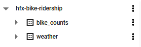
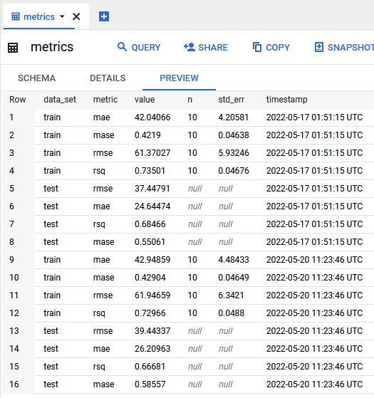
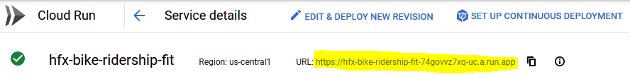
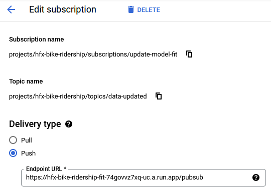
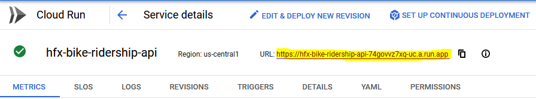
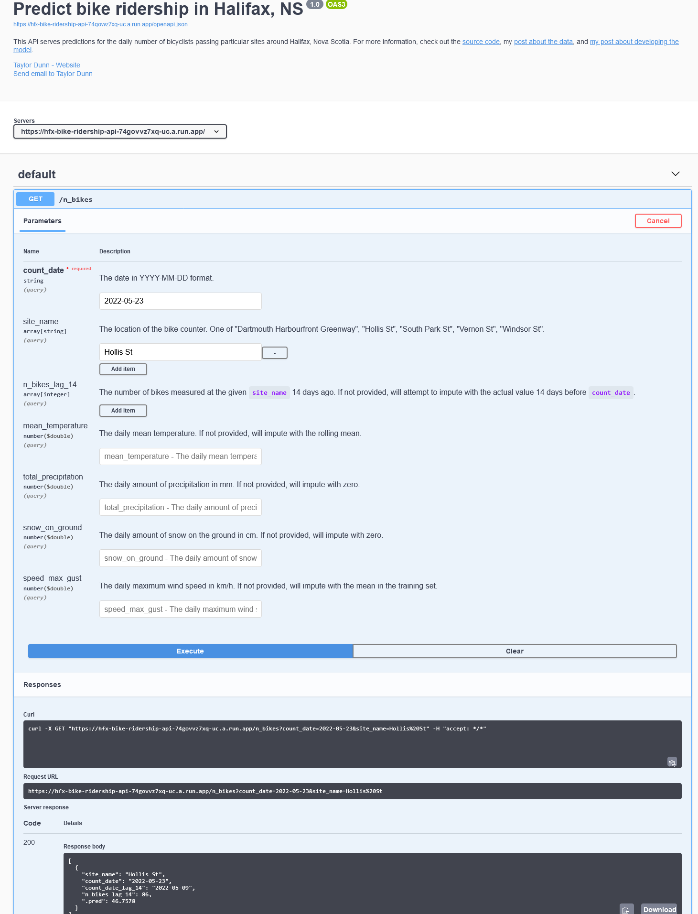

```{r setup, include=TRUE, code_folding="Setup"}
knitr::opts_chunk$set(echo = TRUE)
library(tidyverse)

library(dunnr)
extrafont::loadfonts(device = "win", quiet = TRUE)
theme_set(theme_td())
set_geom_fonts()
set_palette()
```

## Introduction

This is the last in a series of posts about predicting bike ridership in Halifax.
Previously I:

* [retrieved and prepared bicycle counter and weather data](../2022-04-27-predicting-bike-ridership-getting-the-data), then
* [developed and evaluated different machine learning models](../2022-04-29-predicting-bike-ridership-develping-a-model).

Here, I will walk through my steps in putting the model into "production" on Google Cloud Platform (GCP):

* deploying an ETL pipeline with BigQuery and Cloud Scheduler,
* automating model training with Cloud Run and Pub/Sub,
* serving predictions with a REST API via the `plumber` package ([try it out here](https://hfx-bike-ridership-api-74govvz7xq-uc.a.run.app/__docs__/)), and
* developing a Shiny app for exploring predictions ([try it out here](https://www.shinyapps.io/)).

The source code for everything, including Dockerfiles, can be found [here](https://github.com/taylordunn/hfx-bike-ridership).

## Creating the project

Before anything, I had to create and set up a new project on GCP that I called `hfx-bike-ridership`.
In addition to the very detailed GCP documentation, there are lots of great resources out there to walk through all the steps, like [this one](https://arbenkqiku.github.io/create-docker-image-with-r-and-deploy-as-cron-job-on-google-cloud).
In brief: after creating the project, I had to enable billing on the project, activate various APIs, create credentials (OAuth client and service account), and install the Cloud SDK.

## ETL pipeline

I next set up the ETL (extract, load, transform) pipeline to automatically extract the raw data from their sources, perform some transformations, and load it into a database.

In BigQuery, I created the `bike_counts` and `weather` data sets:



I then wrote a script [`etl.R`](https://github.com/taylordunn/hfx-bike-ridership/blob/main/etl/etl.R) that retrieves and processes bike counter data from the Halifax open data platform, and weather data from the government of Canada.
Most of the code there is copied from my previous posts, except for the lines at the end to upload the data to BigQuery tables:

```{r eval=FALSE}
bq_auth("oauth-client.json")

project <- "hfx-bike-ridership"

daily_counts_table <- bq_table(project, "bike_counts", "daily_counts")
weather_table <- bq_table(project, "weather", "daily_report")

bq_table_upload(daily_counts_table,
                value = bike_counts_daily, fields = bike_counts_daily,
                create_disposition = "CREATE_IF_NEEDED",
                write_disposition = "WRITE_TRUNCATE")

bq_table_upload(weather_table,
                value = climate_report_daily, fields = climate_report_daily,
                create_disposition = "CREATE_IF_NEEDED",
                write_disposition = "WRITE_TRUNCATE")
```

This uses the `bigrquery` package to authenticate (`bq_auth()`) using my OAuth credentials and upload (`bq_table_upload()`) the data (creates if missing, overwrites if existing) to the tables `daily_counts` and `daily_report`.
Here is what BigQuery looked like after running this script:


And the `daily_counts` table:


Putting these data into BigQuery, as opposed to a Cloud Storage bucket for example, is convenient for quick queries when I don't want to load the data into R, like this one to find days with zero bikes counted:


I could have simply wrote the data to CSV files and uploaded them via the GCP console, but would defeat the purpose of next step: automation.
To deploy my `etl.R` script, I wrote a fairly simple Dockerfile:

```
FROM rocker/tidyverse:latest

RUN R -e "install.packages(c('bigrquery', 'httr'), repos = 'http://cran.us.r-project.org')"

ADD oauth-client.json /home/rstudio
ADD etl/etl.R /home/rstudio

CMD Rscript /home/rstudio/etl.R
```

Explaining how Docker works is a bit out of scope for this post^[For great introductions to Docker for R users, check out [this by Colin Fay](https://colinfay.me/docker-r-reproducibility/) and [this by Andrew Heiss](https://www.andrewheiss.com/blog/2017/04/27/super-basic-practical-guide-to-docker-and-rstudio/).] but from top to bottom:

* `FROM rocker/tidyverse:latest`
    * The `tidyverse` Docker image provided by RStudio, which you can read more about here: https://hub.docker.com/r/rocker/tidyverse.
    * This image is a bit overkill for this simple script. If I were worried about the size and portability of my image, I would instead use the base R image (https://hub.docker.com/_/r-base) and install only the packages I need from `tidyverse`.
* `RUN R -e "install.packages(c('bigrquery', 'httr'), repos = 'http://cran.us.r-project.org')"`
    * Installs the other packages I need besides those that come with `tidyverse`.
    * Particularly, `httr` for interacting with APIs, and `bigrquery` for BigQuery.
* `ADD oauth-client.json /home/rstudio` and `ADD etl/etl.R /home/rstudio`
    * Add the ETL script and my credentials to the docker container.
* `CMD Rscript /home/rstudio/etl.R`
    * Run the script.
    
I then built the image, tagged it, and pushed it to the Container Registry with these commands:

* `docker build -t hfx-bike-ridership-etl .`
* `docker tag hfx-bike-ridership-etl gcr.io/hfx-bike-ridership/hfx-bike-ridership-etl`
* `docker push gcr.io/hfx-bike-ridership/hfx-bike-ridership-etl:latest`

Now that it exists on GCP, I want to schedule this container to run every week through Cloud Build and Cloud Scheduler.
I used the `googleCloudRunner` package and followed [these instructions](https://code.markedmondson.me/googleCloudRunner/articles/cloudscheduler.html):

```{r eval=FALSE}
library(googleCloudRunner)

cr_setup() # Define project ID and authenticate with credentials

build <- cr_build_make("etl/hfx-bike-ridership-etl.yaml")

cr_schedule(
  # Schedule for every Sunday at 12am
  schedule = "0 0 * * SUN",
  name = "etl",
  httpTarget = cr_schedule_http(build),
  region = "northamerica-northeast1"
)
```

Here is how the job showed up in Cloud Scheduler:


And that's the ETL taken care of.
I left it for a day, and checked the data on Sunday morning to confirm that the data had been updated as expected.

## Model tuning and training

With the data in place, I then added a Cloud Storage bucket to store models, and wrote the
[`tune.R` script](https://github.com/taylordunn/hfx-bike-ridership/blob/main/model/tune/tune.R).

```{r eval=FALSE, code_folding="tune.R"}
# Setup -------------------------------------------------------------------
library(tidyverse)
library(tidymodels)
library(bigrquery)
library(googleCloudStorageR)
library(tictoc)
source("model/preprocess.R")

n_cores <- parallel::detectCores(logical = FALSE)
library(doParallel)
cl <- makePSOCKcluster(n_cores - 1)
registerDoParallel(cl)
# This extra step makes sure the parallel workers have access to the
#  `tidyr::replace_na()` function during pre-processing
parallel::clusterExport(cl, c("replace_na"))

# Read data ---------------------------------------------------

bq_auth(path = "oauth-client.json")

# Define the project, dataset and a new table for this project
project <- "hfx-bike-ridership"

daily_counts_table <- bq_table(project, "bike_counts", "daily_counts")
bike_data <- bq_table_download(daily_counts_table)
bike_data_updated <- bq_table_meta(daily_counts_table)$lastModifiedTime %>%
  as.numeric() %>%
  # `lastModifiedTime` is in milliseconds from 1970-01-01
  {as.POSIXct(. / 1000, origin = "1970-01-01")}

weather_table <- bq_table(project, "weather", "daily_report")
weather_data <- bq_table_download(weather_table)
weather_data_updated <- bq_table_meta(weather_table)$lastModifiedTime %>%
  as.numeric() %>%
  {as.POSIXct(. / 1000, origin = "1970-01-01")}

# Pre-process -------------------------------------------------------------

bike_data <- preprocess(bike_data, weather_data)

# Splitting and resampling ------------------------------------------------

# For the initial time split, data is ordered by date so that the training
#  data consists of the earliest dates across all sites
bike_data <- bike_data %>% arrange(count_date, site_name)
bike_split <- initial_time_split(bike_data, prop = 0.7)

bike_train <- training(bike_split)
bike_test <- testing(bike_split)

# ... but once I'm done splitting the data, I want to order by site followed by
#  date for two reasons:
#  (1) `step_impute_roll()` looks for rows in a window (ordered)
#  (2) the `mase` metric compares predictions to the naive prediction, which
#      uses the previous value
bike_train <- bike_train %>% arrange(count_date, site_name)
bike_test <- bike_test %>% arrange(count_date, site_name)

bike_resamples <-
  sliding_period(bike_train, index = count_date,
                 period = "month", lookback = 13, assess_stop = 1)

# For model versioning, record the splitting and resampling strategy
splits_resamples <- tibble(
  n_data = nrow(bike_data), n_train = nrow(bike_train), n_test = nrow(bike_test),
  min_date_train = min(bike_train$count_date),
  max_date_train = max(bike_train$count_date),
  min_date_test = min(bike_test$count_date),
  max_date_test = max(bike_test$count_date),
  prop = 0.7, resamples = "sliding_period",
  resample_params = "lookback = 13, assess_stop = 1"
)

# Features ------------------------------------------------------------------

# Get Canadian holidays
canada_holidays <-
  timeDate::listHolidays(
    pattern = "^CA|^Christmas|^NewYears|Easter[Sun|Mon]|^GoodFriday|^CaRem"
  )

bike_recipe <-
  recipe(n_bikes ~ count_date + site_name + n_bikes_lag_14 +
           mean_temperature + total_precipitation + speed_max_gust +
           snow_on_ground,
         data = bike_train) %>%
  update_role(count_date, new_role = "date_variable") %>%
  step_date(count_date, features = c("dow", "doy", "year"),
            label = TRUE, ordinal = FALSE) %>%
  step_holiday(count_date, holidays = canada_holidays) %>%
  step_novel(all_nominal_predictors()) %>%
  step_dummy(all_nominal_predictors()) %>%
  step_impute_mean(speed_max_gust) %>%
  step_mutate_at(c(total_precipitation, snow_on_ground),
                 fn = ~ replace_na(., 0)) %>%
  # Use a rolling window to impute temperature
  step_impute_roll(mean_temperature, statistic = mean, window = 31) %>%
  step_zv(all_predictors())


# Model spec and workflow -----------------------------------------------------

xgb_spec <- boost_tree(
  mtry = tune(), trees = tune(), min_n = tune(),
  tree_depth = tune(), learn_rate = tune()
) %>%
  set_engine("xgboost") %>%
  set_mode("regression")

bike_xgb_workflow <- workflow() %>%
  add_recipe(bike_recipe) %>%
  add_model(xgb_spec)

bike_train_baked <- prep(bike_recipe) %>% bake(bike_train)

xgb_grid <- grid_latin_hypercube(
  finalize(mtry(), select(bike_train_baked, -n_bikes)),
  trees(), min_n(), tree_depth(), learn_rate(),
  size = 100
)

# Tune --------------------------------------------------------------------

bike_metrics <- metric_set(rmse, mae, rsq, mase)

set.seed(944)
tic()
xgb_tune <- tune_grid(
  bike_xgb_workflow, resamples = bike_resamples,
  grid = xgb_grid, metrics = bike_metrics
)
toc()

# Choose the hyperparameters by MASE
xgb_params <- select_best(xgb_tune, metric = "mase")
# Also get all the metrics on the training for the chosen parameters
train_metrics <- xgb_params %>%
  left_join(
    collect_metrics(xgb_tune) %>%
      select(.metric, mean, n, std_err, .config),
    by = ".config"
  )

# Finalize and fit to the full training set
bike_xgb_workflow_final <- finalize_workflow(bike_xgb_workflow, xgb_params)
bike_xgb_fit <- bike_xgb_workflow_final %>% fit(bike_train)

# Predict on the test set and get metrics
test_metrics <- bike_xgb_fit %>%
  augment(bike_test) %>%
  bike_metrics(truth = n_bikes, estimate = .pred)

# Compile the model and  info into a list
model_tuned <- list(
  timestamp = Sys.time(),
  bike_data_updated = bike_data_updated,
  weather_data_updated = weather_data_updated,
  splits_resamples = splits_resamples,
  xgb_params = xgb_params,
  train_metrics = train_metrics,
  test_metrics = test_metrics,
  bike_xgb_fit = bike_xgb_fit
)

# Save model and model info -----------------------------------------------

# Model object
write_rds(model_tuned, "model/tune/xgb-model-tuned.rds")
gcs_upload_set_limit(20000000L) # 20 Mb
metadata <- gcs_upload("model/tune/xgb-model-tuned.rds",
                       name = "tune/xgb-model-tuned.rds",
                       bucket = "hfx-bike-ridership-model")
timestamp <- as.POSIXct(metadata$updated,
                        tryFormats = "%Y-%m-%dT%H:%M:%OS", tz = "GMT")

# XGB hyperparameters
xgb_params <- xgb_params %>%
  mutate(timestamp = model_tuned$timestamp) %>%
  select(-.config)
write_csv(xgb_params, "model/tune/xgb-params.csv",
          append = TRUE, col_names = FALSE)
params_table <- bq_table(project, "model_info", "params")
bq_table_upload(params_table,
                value = xgb_params, fields = xgb_params,
                create_disposition = "CREATE_IF_NEEDED",
                write_disposition = "WRITE_APPEND")

# Model metrics
xgb_metrics <- bind_rows(
  train = train_metrics %>%
    select(metric = .metric, value = mean, n, std_err),
  test = test_metrics %>%
    select(metric = .metric, value = .estimate),
  .id = "data_set"
) %>%
  mutate(timestamp = model_tuned$timestamp)
write_csv(xgb_metrics, "model/tune/xgb-metrics.csv",
          append = TRUE, col_names = FALSE)
metrics_table <- bq_table(project, "model_info", "metrics")
bq_table_upload(metrics_table,
                value = xgb_metrics, fields = xgb_metrics,
                create_disposition = "CREATE_IF_NEEDED",
                write_disposition = "WRITE_APPEND")

# Splitting and resampling strategy
splits_resamples <- splits_resamples %>%
  mutate(timestamp = model_tuned$timestamp)
write_csv(splits_resamples, "model/tune/splits-resamples.csv",
          append = TRUE, col_names = FALSE)
splits_resamples_table <- bq_table(project, "model_info", "splits_resamples")
bq_table_upload(splits_resamples_table,
                value = splits_resamples, fields = splits_resamples,
                create_disposition = "CREATE_IF_NEEDED",
                write_disposition = "WRITE_APPEND")
```

This actual model code and choices are [mostly unchanged from my last post](../2022-04-29-predicting-bike-ridership-develping-a-model), but in brief it:
retrieves the latest data from BigQuery, splits the data into training and testing, creates resamples, engineers features, tunes the XGBoost model, finds the best hyperparameters by MASE, and saves the model (as an R object) to the bucket.
I also decided to keep track of metrics with a BigQuery table:



I decided to keep this part of the pipeline manual.
Tuning the XGBoost model takes a while on my machine, even with parallel processing, and I've heard enough [horror stories of surprise charges from cloud services](https://reddit.com/r/datascience/comments/tqe3y6/anyone_needs_ec2_instance/) that I don't feel like risking it.
Also, I only plan on re-tuning if model performance degrades over time.

What I will automate, however, is model training.
Every time the data is updated (i.e. Sundays at midnight), I want to train the tuned model on the full data data.
The idea is pretty simple: get the data from BigQuery, the tuned model from the bucket, fit to the data and save that fit to the same bucket.
The tricky bit is that I wanted this process to trigger only when the data is updated.
It turns out that [BigQuery currently doesn't have native functionality to trigger Cloud Run](https://stackoverflow.com/questions/54792976/trigger-cloud-function-when-new-data-in-bigquery), so I had to use a workaround.

First, I wrote the [`fit.R` function](https://github.com/taylordunn/hfx-bike-ridership/blob/main/model/fit/fit.R) to work as a `plumber` API ([these instructions were helpful](https://code.markedmondson.me/googleCloudRunner/articles/usecase-r-event-driven-pubsub.html)).

```{r eval=FALSE, code_folding="fit.R"}
library(dplyr)
library(readr)
library(tidymodels)
library(bigrquery)
library(googleCloudStorageR)
library(googleCloudRunner)
library(plumber)
source("preprocess.R")

bq_auth(path = "oauth-client.json")
gcs_auth("oauth-client.json")
gcs_upload_set_limit(20000000L) # 20 Mb

# This function will retrieve the latest data from BigQuery, the latest
#  model from Cloud Storage, and
pub <- function(message) {
  # Define the project, dataset and a new table for this project
  project <- "hfx-bike-ridership"

  daily_counts_table <- bq_table(project, "bike_counts", "daily_counts")
  bike_data <- bq_table_download(daily_counts_table)
  bike_data_updated <- bq_table_meta(daily_counts_table)$lastModifiedTime %>%
    as.numeric() %>%
    {as.POSIXct(. / 1000, origin = "1970-01-01")}


  weather_table <- bq_table(project, "weather", "daily_report")
  weather_data <- bq_table_download(weather_table)
  weather_data_updated <- bq_table_meta(weather_table)$lastModifiedTime %>%
    as.numeric() %>%
    {as.POSIXct(. / 1000, origin = "1970-01-01")}

  bike_data <- preprocess(bike_data, weather_data)
  xgb_tuned <- gcs_get_object("tune/xgb-model-tuned.rds",
                              bucket = "hfx-bike-ridership-model",
                              parseFunction = gcs_parse_rds)

  message("Writing updating xgb-fit")
  xgb_fit <- list(
    tune_timestamp = xgb_tuned$timestamp,
    timestamp = Sys.time(),
    bike_data_updated = bike_data_updated,
    weather_data_updated = weather_data_updated,
    bike_xgb_fit = fit(xgb_tuned$bike_xgb_fit, bike_data)
  )

  f <- function(input, output) write_rds(input, output)
  metadata <- gcs_upload(xgb_fit, name = "xgb-fit.rds",
                         bucket = "hfx-bike-ridership-model",
                         object_function = f)

  return(TRUE)
}

#' Receive pub/sub message
#' @post /pubsub
#' @param message a pub/sub message
function(message = NULL) {
  message("Received message ", message)
  googleCloudRunner::cr_plumber_pubsub(message, pub)
}
```

I wrote a [Docker file to containerize the API](https://github.com/taylordunn/hfx-bike-ridership/blob/main/model/fit/Dockerfile), built the image, and pushed it to the Container Registry.
I then went to Cloud Run, created a new service called `hfx-bike-ridership-fit` using the just-uploaded Docker image:


Once up and running, this gave me a URL from which to query the API:



Next, I had to set up an internal messaging system.
The steps were:

1. I added a `message("Finished ETL pipeline")` at the end of the `etl.R` script to indicate that the data was updated.
2. This message shows up in Cloud Logging, so I added a "sink" (which is how Logging routes messages) to look for this specific log.


3. The destination of this sink is a Pub/Sub topic called `data-updated`.
4. I added a subscription to this topic which pushes a POST request to the API



5. The POST request triggers the model fitting code, and the updated model is uploaded to the Storage bucket.

This seems like a complex workaround for a fairly simple task -- I might be missing a easier method.
Also, it may have made more sense to just have the model re-training on a weekly schedule, just after the ETL pipeline, but I wanted more flexibility for ad hoc updates.
Regardless, both the ETL and model training are now fully automated.

## Deployment

### REST API

To deploy the model, I wrote another `plumber` API in the [`api.R` script](https://github.com/taylordunn/hfx-bike-ridership/blob/main/model/api/api.R):

```{r code_folding="api.R", eval=FALSE}
#* @apiTitle Predict bike ridership in Halifax, NS
#* @apiDescription This API serves predictions for the daily number of bicyclists passing particular sites around Halifax, Nova Scotia. For more information, check out the [source code](https://github.com/taylordunn/hfx-bike-ridership), my [post about the data](https://tdunn.ca/posts/2022-04-27-predicting-bike-ridership-getting-the-data/), and [my post about developing the model](https://tdunn.ca/posts/2022-04-29-predicting-bike-ridership-developing-a-model/).
#* @apiContact list(name = "Taylor Dunn", url = "http://www.tdunn.ca", email = "t.dunn19@gmail.com")
#* @apiVersion 1.0

library(plumber)
library(dplyr)
library(tidymodels)
library(bigrquery)
library(googleCloudStorageR)

bq_auth(path = "oauth-client.json",
        email = "hfx-bike-ridership@hfx-bike-ridership.iam.gserviceaccount.com")
gcs_auth("oauth-client.json")

project <- "hfx-bike-ridership"

message("Reading data")
daily_counts_table <- bq_table(project, "bike_counts", "daily_counts")
bike_data <- bq_table_download(daily_counts_table)

message("Loading model")
xgb_fit <- gcs_get_object("xgb-fit.rds", bucket = "hfx-bike-ridership-model",
                          parseFunction = gcs_parse_rds)

site_names <- c("Dartmouth Harbourfront Greenway", "Hollis St",
                "South Park St", "Vernon St", "Windsor St")

#* @param count_date:str The date in YYYY-MM-DD format.
#* @param site_name:[str] The location of the bike counter. One of "Dartmouth Harbourfront Greenway", "Hollis St", "South Park St", "Vernon St", "Windsor St".
#* @param n_bikes_lag_14:[int] The number of bikes measured at the given `site_name` 14 days ago. If not provided, will attempt to impute with the actual value 14 days before `count_date`.
#* @param mean_temperature:numeric The daily mean temperature. If not provided, will impute with the rolling mean.
#* @param total_precipitation:numeric The daily amount of precipitation in mm. If not provided, will impute with zero.
#* @param snow_on_ground:numeric The daily amount of snow on the ground in cm. If not provided, will impute with zero.
#* @param speed_max_gust:numeric The daily maximum wind speed in km/h. If not provided, will impute with the mean in the training set.
#* @get /n_bikes
function(count_date, site_name = NA_character_, n_bikes_lag_14 = NA_integer_,
         mean_temperature = NA_real_, total_precipitation = NA_real_,
         snow_on_ground = NA_real_, speed_max_gust = NA_real_) {

  # If not provided, use all `site_name`s
  if (any(is.na(site_name))) {
    site_name <- site_names
  } else {
    site_name <- match.arg(
      site_name, choices = site_names, several.ok = TRUE
    )
  }

  count_date <- as.Date(count_date)

  # Get the 14-day lagged bike counts for each site
  if (!is.na(n_bikes_lag_14) & length(site_name) != length(n_bikes_lag_14)) {
    return(list(
      status = 400,
      message = "Must provide a value of `n_bikes_lag_14` for every given `site_name`."
    ))
  } else {
    d <- tibble(site_name = .env$site_name, count_date = .env$count_date,
                count_date_lag_14 = count_date - 14,
                n_bikes_lag_14 = .env$n_bikes_lag_14)

    if (sum(is.na(d$n_bikes_lag_14)) > 0) {
      message("Imputing `n_bikes_lag_14`")
      d <- d %>%
        left_join(
          bike_data %>%
            select(site_name, count_date_lag_14 = count_date,
                   n_bikes_lag_14_impute = n_bikes),
          by = c("site_name", "count_date_lag_14")
        ) %>%
        mutate(
          n_bikes_lag_14 = ifelse(is.na(n_bikes_lag_14),
                                  n_bikes_lag_14_impute, n_bikes_lag_14)
        ) %>%
        select(-n_bikes_lag_14_impute)

      if (sum(is.na(d$n_bikes_lag_14)) > 0) {
        return(list(
          status = 400,
          message = paste0(
            "Could not find `n_bikes_lag_14` values on date ", count_date,
            " for these sites ",
            filter(d, is.na(n_bikes_lag_14)) %>% pull(site_name) %>% paste(collapse = ", "),
            ". Please provide your own `n_bikes_lag_14`, or choose a different `count_date`."
          )
        ))
      }
    }
  }

  # Add weather variables
  d <- d %>%
    mutate(
      n_bikes_lag_14 = as.numeric(n_bikes_lag_14),
      mean_temperature = as.numeric(mean_temperature),
      total_precipitation = as.numeric(total_precipitation),
      snow_on_ground = as.numeric(snow_on_ground),
      speed_max_gust = as.numeric(speed_max_gust)
    )

  augment(xgb_fit$bike_xgb_fit, d)
}

#* @get /model_info
#* @response 200 Returns model information: timestamps of when the model was last trained (`timestamp`), the model was last tuned (`tune_timestamp`), the bicycle data was last updated (`bike_data_updated`), the weather data was last updated (`weather_data_updated`).
function() {
  list(
    timestamp = xgb_fit$timestamp,
    tune_timestamp = xgb_fit$tune_timestamp,
    bike_data_updated = xgb_fit$bike_data_updated,
    weather_data_updated = xgb_fit$weather_data_updated
  )
}

```

This reads in the model from the Cloud Storage bucket and the latest bike data from BigQuery.
As inputs, it requires only a single date (`count_date`), for which it will return predictions for all 5 sites.
One or more specific sites can also be provided (`site_name`).
If the lagged values (`n_bikes_lag_14`) are not provided, then they will be imputed from the bike data (an error will be returned if the lagged value cannot be imputed).
The weather inputs `mean_temperature`, `total_precipitation`, `snow_on_ground`, and `speed_max_gust` are imputed if not provided.

As with `fit.R`, I put this into a [Docker container](https://github.com/taylordunn/hfx-bike-ridership/blob/main/model/api/Dockerfile), pushed to Container Registry, and created a Cloud Run service `hfx-bike-ridership-api` using that image.



Unlike the previous Cloud Run service which only accepts internal requests, this one is publicly available.
For instance, I can get a prediction for tomorrow's `n_bikes` on Hollis St with the following R code:

```{r n-bikes-query, cache=TRUE}
base_url <- "https://hfx-bike-ridership-api-74govvz7xq-uc.a.run.app/"
query <- "n_bikes?count_date=2022-05-23&site_name=Hollis St"

library(httr)

paste0(base_url, query) %>%
  URLencode() %>%
  GET() %>%
  content(as = "parsed") %>%
  purrr::flatten()
```

A great feature of `plumber` is that uses a nice HTML interface for documenting and interacting with REST APIs.
Check out this API here: https://hfx-bike-ridership-api-74govvz7xq-uc.a.run.app/__docs__/.
(Screenshot below for posterity.)



I also added a `model_info` option, which can be queried to see timestamps of when the model was tuned and fit, and when the data were updated last:

```{r model-info-query, cache=TRUE}
query <- "model_info"
paste0(base_url, query) %>%
  URLencode() %>%
  GET() %>%
  content(as = "parsed") %>%
  purrr::flatten()
```

### Shiny app

## Conclusion


## Reproducibility {.appendix}

<details><summary>Session info</summary>

```{r echo=FALSE}
devtools::session_info()$platform
devtools::session_info()$packages %>%
  rmarkdown::paged_table()
```

</details>

<details><summary>Git repository</summary>

```{r echo=FALSE}
git2r::repository()
```

</details>

```{r echo=FALSE}
dunnr::get_distill_source(date = params$date, slug = params$slug)
```

